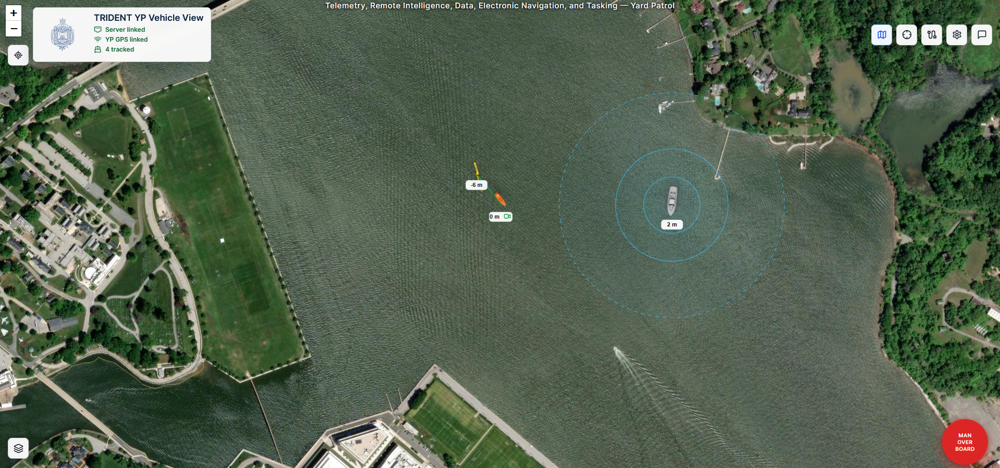

# YP Ground Station



Shipboard ground station for a Naval Academy Yard Patrol craft. The stack collects vehicle telemetry from USVs, UAVs, UUVs, and the YP GPS feed, logs ROS2-shaped messages to InfluxDB, and serves a local-first React map interface for monitoring, command, and SAR mission control via the embedded Lifeguard system.

## What Is Included

- `yp-server`: FastAPI service with native vehicle WebSockets, a lightweight rosbridge-compatible WebSocket, REST APIs, on-demand OpenStreetMap tile caching, command routing, InfluxDB logging, and the embedded Lifeguard MAVLink mission manager.
- `web`: React + TypeScript + Leaflet UI with a full-screen map, vehicle markers, altitude labels, headings, recent trails, hover data, RTB commands, click-to-waypoint commands, and the Bridge Panel for Lifeguard SAR mission control.
- `sim-vehicle`: Configurable simulated UAV, USV, or UUV container that publishes heartbeat, `NavSatFix`, `Pose`, `BatteryState`, and `MultiDOFJointTrajectory` messages at 5 Hz and accepts commands.
- `yp-gps`: YP GPS publisher. It can run in simulated mode near the US Naval Academy or read NMEA GPS data from a serial port.
- `influxdb`: Time-series storage for all telemetry and command messages.

## Quick Start

```bash
docker compose up --build
```

Then open:

- Web UI: `http://localhost:8080`
- API docs: `http://localhost:8000/docs`
- API root/status links: `http://localhost:8000`
- InfluxDB: `http://localhost:8086`

The default compose file starts one simulated UAV, one simulated USV, one simulated UUV, and a simulated YP GPS source located near the Severn River off the US Naval Academy.

## Scaling Simulated Vehicles

To stress test with more simulated vehicles:

```bash
docker compose up --build --scale sim-uav=10 --scale sim-usv=4 --scale sim-uuv=3
```

Each simulator derives a unique ID from its container hostname unless `VEHICLE_ID` is explicitly set.

## Web UI

The map shows:

- Green USV markers
- Orange UAV markers
- Yellow UUV markers
- Blue YP marker
- Heading arrow for each vehicle
- Altitude beside each marker
- Adjustable recent trail duration
- Hover popup with telemetry
- Click modal with `RTB` and waypoint command actions

To command a waypoint, click a vehicle, choose `Waypoint`, then click the map. The server sends a command message to that vehicle's WebSocket connection.

## Bridge Panel — Lifeguard SAR Control

The Bridge Panel is an overlay control surface intended for the ship's bridge display. It exposes Lifeguard mission control without voice commands.

Open it with the warning-triangle button (⚠) in the top-right toolbar.

### Grid Search

1. Click **Tap Corner 1** then tap the map to pin the first corner of the search area.
2. Click **Tap Corner 2** then tap the second corner.
3. A yellow rectangle is drawn on the map showing the planned search boundary.
4. Adjust **altitude** and **swath width** as needed, select the agent to dispatch, then click **Dispatch Grid Search**.

The server computes the grid centre and size from the two corner coordinates, generates a lawnmower-pattern waypoint mission, uploads it to the drone via MAVLink, arms the vehicle, and starts the mission automatically.

### MOB — Man Overboard

Pressing the large red **MOB** button immediately dispatches the first idle aerial agent on a parallel-track search along the ship's recent GPS track. No configuration is required — the ship track is built automatically from the `yp` vehicle's live position feed.

If a target is subsequently found, the searching agent returns to the ship and a second idle agent (if available) is dispatched to verify the position with a tight grid search.

### Agent Status

The panel lists each configured agent with its connection state and current mission. An agent is shown as idle, running a named mission (`grid_search`, `mob`), or offline.

### Status Log

A scrollable log shows the last 200 status messages from all agents including arming status, mission progress, and any errors.

## Lifeguard Configuration

Lifeguard agent connections and mission defaults are stored in a JSON config file on the server host. The path is set via the `LIFEGUARD_CONFIG_PATH` environment variable (default `/data/lifeguard_config.json`).

Example config:

```json
{
  "agents": [
    {
      "name": "Drone Junior",
      "connection_string": "tcp:192.168.0.110:5760",
      "frame_type": "UAV"
    }
  ],
  "mission": {
    "default_waypoint_altitude": 30.0,
    "default_swath_width": 20.0
  },
  "mavlink": {
    "baudrate": 57600,
    "source_system_id": 252
  },
  "ship": {
    "track_history_minutes": 30,
    "mob_corridor_half_width_m": 50.0,
    "mob_takeoff_altitude_m": 100.0,
    "mob_climb_speed_ms": 8.0
  }
}
```

The config can also be read and updated at runtime via the REST API:

```bash
# Read current config
curl http://localhost:8000/api/lifeguard/config

# Write updated config
curl -X POST http://localhost:8000/api/lifeguard/config \
  -H "Content-Type: application/json" \
  -d @lifeguard_config.json

# List agent connection states
curl http://localhost:8000/api/lifeguard/agents
```

Config changes take effect for subsequent missions without restarting the server. Agent reconnection requires a restart or a `connect_agent` WebSocket command.

### Lifeguard WebSocket Commands

Commands are sent from the browser (or any WebSocket client) to `ws://<host>:8000/ws/ui`:

```json
{ "op": "lifeguard_command", "command": "grid_search",
  "agent_id": "Drone Junior", "lat": 38.9822, "lon": -76.4819,
  "grid_size_m": 300, "swath_m": 20, "altitude_m": 30 }

{ "op": "lifeguard_command", "command": "mob" }

{ "op": "lifeguard_command", "command": "fly_to",
  "agent_id": "Drone Junior", "lat": 38.9830, "lon": -76.4810, "altitude_m": 30 }

{ "op": "lifeguard_command", "command": "rtb", "agent_id": "Drone Junior" }

{ "op": "lifeguard_command", "command": "connect_agent",
  "name": "Drone Junior", "connection_string": "tcp:192.168.0.110:5760", "frame_type": "UAV" }

{ "op": "lifeguard_command", "command": "disconnect_agent", "agent_id": "Drone Junior" }
```

Server-to-client events:

| `op` | Payload | Description |
|---|---|---|
| `lifeguard_agents` | `{ agents: [...] }` | Updated agent list after any state change |
| `lifeguard_status` | `{ agent_id, message, level, stamp }` | Per-agent status message (`info`, `warn`, or `error`) |
| `lifeguard_config` | `{ config: {...} }` | Full config object (sent on connect and after updates) |
| `lifeguard_path` | `{ agent_id, path: [[lat,lon], ...] }` | Uploaded mission waypoints for map display |

### How Ship GPS Feeds MOB

The `yp` vehicle's live GPS (published by the `yp-gps` service) is automatically sampled by the server at ten-second intervals and appended to the Lifeguard ship track. No separate MAVLink connection to the ship is required. The track drives the MOB parallel-search corridor geometry.

### Drone Positions on Map

Drones managed by Lifeguard publish their `GLOBAL_POSITION_INT` positions into the shared vehicle tracking system at 5 Hz. They appear on the Leaflet map alongside all other vehicles — no extra configuration is needed.

## Message Transport

### Native Vehicle WebSocket

Vehicle clients connect to:

```text
ws://<server-host>:8000/ws/vehicle/<vehicle_id>
```

Publish messages shaped like:

```json
{
  "vehicle_id": "uav-alpha",
  "vehicle_type": "uav",
  "topic": "/vehicles/uav-alpha/navsatfix",
  "type": "sensor_msgs/msg/NavSatFix",
  "stamp": 1778952000.25,
  "msg": {
    "header": {
      "stamp": { "sec": 1778952000, "nanosec": 250000000 },
      "frame_id": "map"
    },
    "status": { "status": 0, "service": 1 },
    "latitude": 38.982,
    "longitude": -76.483,
    "altitude": 45.0,
    "position_covariance": [0,0,0,0,0,0,0,0,0],
    "position_covariance_type": 0
  }
}
```

Commands sent back to vehicles look like:

```json
{
  "op": "command",
  "vehicle_id": "uav-alpha",
  "command": {
    "type": "waypoint",
    "target": { "latitude": 38.9825, "longitude": -76.4841, "altitude": 35.0 }
  }
}
```

RTB commands use:

```json
{ "type": "rtb" }
```

### Rosbridge-Like WebSocket

ROS-style clients can connect to:

```text
ws://<server-host>:8000/ws/rosbridge
```

Supported operations:

- `publish`
- `subscribe`
- `unsubscribe`

Example publish:

```json
{
  "op": "publish",
  "topic": "/vehicles/uav-alpha/navsatfix",
  "type": "sensor_msgs/msg/NavSatFix",
  "msg": {
    "latitude": 38.982,
    "longitude": -76.483,
    "altitude": 45.0
  }
}
```

This is intentionally small and practical. It is not a full rosbridge replacement yet, but it keeps topic names and message fields compatible with ROS2 conventions.

## ROS2-Shaped Messages

The simulator and server use JSON messages matching the main ROS2 field names for:

- `trajectory_msgs/msg/MultiDOFJointTrajectoryPoint`
- `trajectory_msgs/msg/MultiDOFJointTrajectory`
- `sensor_msgs/msg/NavSatFix`
- `geometry_msgs/msg/Pose`
- `sensor_msgs/msg/BatteryState`

The trajectory and pose messages can be telemetry from a vehicle or command-like messages sent toward a vehicle.

## Raspberry Pi Vehicle Container Path

For real vehicle Raspberry Pis, start from `services/sim_vehicle` and replace the simulator movement loop with MAVLink IO:

1. Read Cube/Pixhawk telemetry using MAVLink, MAVROS, or a ROS2 bridge.
2. Convert telemetry into the ROS2-shaped JSON messages above.
3. Publish to `/ws/vehicle/<vehicle_id>` at the desired rate.
4. Listen on the same WebSocket for `waypoint`, `trajectory`, and `rtb` commands.
5. Convert commands back to MAVLink mission/setpoint/RTL commands.

The server does not require ROS to be installed, but the topic names and message payloads are intentionally ROS-friendly.

## YP GPS

The default compose file runs:

```yaml
GPS_MODE: sim
HOME_LAT: "38.984764"
HOME_LON: "-76.478643"
HEADING_DEG: "330"
SPEED_KNOTS: "3"
```

To use a real serial GPS, change the `yp-gps` service:

```yaml
environment:
  GPS_MODE: serial
  SERIAL_PORT: /dev/ttyUSB0
  BAUD_RATE: 9600
devices:
  - /dev/ttyUSB0:/dev/ttyUSB0
```

The GPS container publishes the YP as a `yp` vehicle with `NavSatFix`, `Pose`, `BatteryState`, and heartbeat messages so the map can center on the ship.

In simulated mode, the YP starts at latitude `38.984764`, longitude `-76.478643`, heading `330` degrees, and moves at `3` knots unless those environment variables are changed.

## Map Tiles

The web UI has two map modes:

- `Auto`: default street map. Serve from the street-map cache when present; otherwise fetch the visible tile from OpenStreetMap and cache it.
- `Earth View`: satellite/earth imagery. Serve from the earth-view cache when present; otherwise fetch the visible tile from Esri World Imagery and cache it.

The map modes use:

```text
http://localhost:8000/tiles/osm/<z>/<x>/<y>.png
http://localhost:8000/tiles/earth/<z>/<x>/<y>.png
```

When the operator views or pans the map, Leaflet requests only the tiles needed for the current viewport. The server fetches missing tiles from the configured sources:

```text
https://tile.openstreetmap.org/{z}/{x}/{y}.png
https://services.arcgisonline.com/ArcGIS/rest/services/World_Imagery/MapServer/tile/{z}/{y}/{x}
```

Fetched tiles are cached on the server in:

```text
data/tile-cache/
```

That folder is mounted into Docker as `/data/tile-cache`, so cached map tiles persist across container restarts and rebuilds.

If a tile is not cached and the server cannot reach the internet, the server returns a plain light-blue tile instead of a broken tile/error image.

Check cache status:

```bash
curl http://localhost:8000/api/tile-cache
```

Clear the cache:

```bash
rm -rf data/tile-cache
```

The app does not bulk download, pre-seed, or scan map areas. It caches only tiles requested by the active map viewport. The server stores per-source cache metadata and uses conditional requests when cached tiles expire.

OpenStreetMap's public tile service allows normal interactive viewing and local caching according to HTTP cache headers, but prohibits bulk downloads and offline prefetch features. Earth View uses Esri World Imagery by default. If this system later needs guaranteed offline maps for large areas, use a self-hosted tile server or a provider that explicitly allows offline packages.

## Configuration

Useful environment variables:

| Service | Variable | Default | Description |
| --- | --- | --- | --- |
| `yp-server` | `INFLUX_URL` | `http://influxdb:8086` | InfluxDB URL |
| `yp-server` | `INFLUX_ORG` | `yp` | InfluxDB org |
| `yp-server` | `INFLUX_BUCKET` | `telemetry` | InfluxDB bucket |
| `yp-server` | `INFLUX_TOKEN` | `yp-dev-token` | InfluxDB token |
| `yp-server` | `TILE_CACHE_DIR` | `/data/tile-cache` | Persistent on-demand map tile cache |
| `yp-server` | `OSM_TILE_URL` | `https://tile.openstreetmap.org/{z}/{x}/{y}.png` | Tile source URL template |
| `yp-server` | `OSM_USER_AGENT` | `YPGroundStation/0.1` | Identifying user agent for OSM tile requests |
| `yp-server` | `OSM_REFERER` | `http://localhost:8080/` | Referer sent with OSM tile requests |
| `yp-server` | `EARTH_TILE_URL` | `https://services.arcgisonline.com/ArcGIS/rest/services/World_Imagery/MapServer/tile/{z}/{y}/{x}` | Earth View tile source URL template |
| `yp-server` | `EARTH_USER_AGENT` | `YPGroundStation/0.1` | Identifying user agent for Earth View tile requests |
| `yp-server` | `EARTH_REFERER` | `http://localhost:8080/` | Referer sent with Earth View tile requests |
| `yp-server` | `MIN_TILE_TTL_SECONDS` | `604800` | Fallback cache TTL when headers are unavailable |
| `yp-server` | `LIFEGUARD_CONFIG_PATH` | `/data/lifeguard_config.json` | Path to the Lifeguard agent/mission config file |
| `yp-server` | `YP_VEHICLE_ID` | `yp` | Vehicle ID used to feed ship GPS into the MOB track |
| `sim-*` | `VEHICLE_TYPE` | `uav` | `uav`, `usv`, or `uuv` |
| `sim-*` | `VEHICLE_ID` | auto | Optional fixed vehicle ID |
| `sim-*` | `HOME_LAT` | `38.9822` | RTB/home latitude |
| `sim-*` | `HOME_LON` | `-76.4819` | RTB/home longitude |
| `yp-gps` | `GPS_MODE` | `sim` | `sim` or `serial` |
| `yp-gps` | `SERIAL_PORT` | `/dev/ttyUSB0` | NMEA GPS serial device |
| `yp-gps` | `HEADING_DEG` | `330` | Simulated YP heading in degrees |
| `yp-gps` | `SPEED_KNOTS` | `3` | Simulated YP speed |

## Development

Run just the backend locally:

```bash
cd services/server
python3 -m venv .venv
. .venv/bin/activate
pip install -r requirements.txt
uvicorn app.main:app --reload --host 0.0.0.0 --port 8000
```

Run the frontend locally:

```bash
cd web
npm install
npm run dev
```

## Notes For Real Vehicles

- Keep vehicle IDs stable and unique.
- Prefer one WebSocket per vehicle.
- Use the native WebSocket first for the smallest moving part count.
- Add authentication before putting this on anything other than a trusted local shipboard network.
- Validate waypoint commands on the vehicle side before forwarding to the Cube/Pixhawk.
- Keep a manual RC/safety pilot path independent of the web UI.
- Lifeguard connects to drone Cube/Pixhawk autopilots directly via pymavlink using TCP or UDP connection strings. Ensure the autopilot's MAVLink port is reachable from the server container (add the drone network to `docker-compose.yml` if needed).
- The `LIFEGUARD_CONFIG_PATH` file is written inside the container. Mount a host path (e.g. `./data:/data`) so config persists across container rebuilds.
